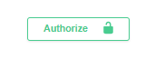
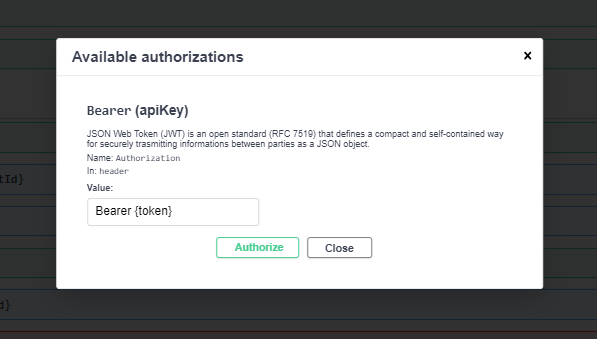
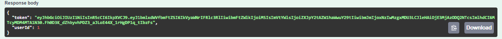

# SorteOnlineDesafio Documentation

## 📄 Overview

SorteOnlineDesafioApi is an ASP.NET Web API project designed to manage clients and orders for a store. It is built using .NET version 7.0.

## 🌐 Base URL

The base URL for all endpoints is `https://localhost:7131/api`.

## 🔐 Authentication

Authentication is required to access endpoints prefixed with "user" and "store". Authentication is done via Bearer Token.

### Accessing Endpoints with Authentication

1. **Lock Icon Button**: Click on the lock icon button located at the top-right corner of the Swagger UI.
   - This will allow you to authorize requests by entering your Bearer Token.

   

2. **Bearer Token**: Once authorized, you can input your Bearer Token in the "Bearer Token" input box located next to the lock icon.
   - Use the token received after successful authentication to access protected endpoints prefixed with "user" and "store".

   

3. **Getting the Bearer Token**:
   - To obtain the Bearer Token:
     - Use the **Sign Up** (`/auth/signup`) endpoint to register a new user with name, email, and password.
     - Or use the **Sign In** (`/auth/signin`) endpoint to authenticate with your registered email and password.
   - Upon successful registration or authentication, the response body will include the Bearer Token required for subsequent requests.

   

### AuthController

#### 🔑 Sign In


- **Method:** POST
- **Endpoint:** /auth/signin
- **Description:** Authenticates a user with email and password.
- **Request Body:**
    ```json
    {
        "email": "string",
        "password": "string"
    }
    ```
- **Response:**
  - Status Code 200 OK
  - Returns a token for authentication.

#### 📝 Sign Up

- **Method:** POST
- **Endpoint:** /auth/signup
- **Description:** Registers a new user with name, email, and password.
- **Request Body:**
    ```json
    {
        "name": "string",
        "email": "string",
        "password": "string"
    }
    ```
- **Response:**
  - Status Code 201 Created
  - Returns a token for authentication and the ID of the newly created user.

### UserController

#### 👥 Get All Users

- **Method:** GET
- **Endpoint:** /user/all
- **Description:** Retrieves all users.
- **Response:**
  - Status Code 200 OK
  - Returns a list of all users.

#### 👤 Get User by ID

- **Method:** GET
- **Endpoint:** /user/{id}
- **Description:** Retrieves a user by their ID.
- **Parameters:**
  - `id` (integer): The ID of the user to retrieve.
- **Response:**
  - Status Code 200 OK
  - Returns the user information.

### StoreController

#### 🛍️ Create Client

- **Method:** POST
- **Endpoint:** /store/client/create
- **Description:** Creates a new client with the provided name and email.
- **Request Body:**
    ```json
    {
        "name": "string",
        "email": "string"
    }
    ```
- **Response:**
  - Status Code 201 Created
  - Returns the newly created client.

#### 🆔 Get Client by ID

- **Method:** GET
- **Endpoint:** /store/client/{clientId}
- **Description:** Retrieves a client by their ID.
- **Parameters:**
  - `clientId` (integer): The ID of the client to retrieve.
- **Response:**
  - Status Code 200 OK
  - Returns the client information.

#### 🧾 Get All Clients

- **Method:** GET
- **Endpoint:** /store/client/all
- **Description:** Retrieves all clients.
- **Response:**
  - Status Code 200 OK
  - Returns a list of all clients.

#### 🛒 Create Order

- **Method:** POST
- **Endpoint:** /store/order/create
- **Description:** Creates a new order for a client.
- **Request Body:**
    ```json
    {
        "clientId": 0,
        "totalValue": 0
    }
    ```
- **Response:**
  - Status Code 201 Created
  - Returns the newly created order.

#### 📦 Get Order by ID

- **Method:** GET
- **Endpoint:** /store/order/{orderId}
- **Description:** Retrieves an order by its ID.
- **Parameters:**
  - `orderId` (integer): The ID of the order to retrieve.
- **Response:**
  - Status Code 200 OK
  - Returns the order information.

#### 🧾 Get All Orders

- **Method:** GET
- **Endpoint:** /store/order/all
- **Description:** Retrieves all orders.
- **Response:**
  - Status Code 200 OK
  - Returns a list of all orders.

#### ❌ Delete Order

- **Method:** DELETE
- **Endpoint:** /store/order/{orderId}
- **Description:** Deletes an order by its ID.
- **Parameters:**
  - `orderId` (integer): The ID of the order to delete.
- **Response:**
  - Status Code 204 No Content

#### 🛍️🛒 Create Client and Order

- **Method:** POST
- **Endpoint:** /store/client-order/create
- **Description:** Creates a new client and places an order for them.
- **Request Body:**
    ```json
    {
        "name": "string",
        "email": "string",
        "totalValue": 0
    }
    ```
- **Response:**
  - Status Code 201 Created
  - Returns the newly created client and order details.

#### 🛍️📦 Get Client with All Orders by ID

- **Method:** GET
- **Endpoint:** /store/client-order/{clientId}
- **Description:** Retrieves a client by ID along with all their orders.
- **Parameters:**
  - `clientId` (integer): The ID of the client to retrieve.
- **Response:**
  - Status Code 200 OK
  - Returns the client information along with all associated orders.

#### 🛍️❌ Delete Client and All Their Orders

- **Method:** DELETE
- **Endpoint:** /store/client-order/{clientId}
- **Description:** Deletes a client by ID along with all their associated orders.
- **Parameters:**
  - `clientId` (integer): The ID of the client to delete.
- **Response:**
  - Status Code 204 No Content
